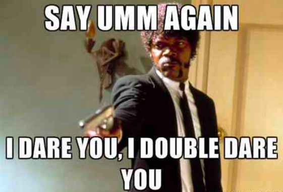

## Welcome to Runtime 99 

Lets start off with the oldest question in the book that there is -

**So, Introduce yourself?**
 
This is your ticket to shine. This is the question that you should, at the very very least have a thought out answer to. You should start off like this

```markdown

- What is your full God given name
- Insert humorous naming incident and/or any nicknames with preferably an origin story for that nickname
- Where did you go to school?
- What did you do before this?
- And an anecdote about how you ended up here at this very moment

``` 
 
It does not have to be formal, it does not even have to be rehearsed. Just try to get through it without too many “Ummmmms….”. Its your introduction dammit, you are supposed to get that right.
 


--- 

_Here are a few examples_
 
Heylo John Interviewee! Tell me about yourself

```markdown
 
- I am John, John Interviewee
- My friends call me int because we learnt programming together :)
- This will be my first job after college
- I had a couple of research internships at the crack den – that’s what we called our AI Lab
- One of my professors referred me to this job and I am excited to be here!

```
 
See: that was perfect, how about a grown up John version for those with **some experience?**
 
Heylo John Interviewee! Tell me about yourself
 
```markdown

- I am John, John Interviewee
- My friends call me View because I worked at CBS before this and they had this hit show
- This will be my first job back in the bay after about 4 years
- I worked on virtualization and graphics rendering
- I am excited about the advances that your company has made so I wanted to send in my application
- And hopefully move back to the bay and check you guys out!

```

See: That was awesome. He is relaxed; he draws on his experience and right off the bat he brings in his own reason for wanting to join this company. This may or may not be genuine but it surely sets up a good platform for future conversation. 

---
####Here’s an example of how this would not have gone well
 
Heylo John Interviewee! Tell me about yourself
 
Ans:
 
- Hello
- Kind and esteemed gentleman, I am happy to share this stage of life with you
- I am an extremely hard workder because I believe that work will set me free if I have blind faith in myself
- And much like the financial crisis of 2008, I believe in having an impact
- I have experience as a Software Engineer
- I like your posting for job, I would like to be hired
 
Believe me, the quoting Hitler bit was the least of this guys problems. So, allow me to demonstrate where this guy went wrong

- Fuck off John, no one says Hello anymore. Hi is in
- Do not be formal in a place where people blare rap, down beer kegs and wear shorts
- Right off the bat, do not sound stubborn
- Impacts are good and bad, lets not lean towards the latter
- Generic introductions are bad introductions
- You are here for a “chat”, a “Conversation”. You are not here to be hired. Do not sound desperate

I hope this was helpful in figuring out how to tackle the softballs. Next week, we tackle the real painful pieces of the interview process. 

## Stay in touch with us! 


**Get notified when our new piece is out** 
<!-- Begin MailChimp Signup Form -->
<div id="mc_embed_signup">
<form action="//blogger.us3.list-manage.com/subscribe/post?u=87dd3bfd31fcd90762adfd7bd&amp;id=f7a199b9ba" method="post" id="mc-embedded-subscribe-form" name="mc-embedded-subscribe-form" class="validate" target="_blank" novalidate>
<div id="mc_embed_signup_scroll">
<label for="mce-EMAIL">Help us help you by entering your email address</label>
<input type="email" value="" name="EMAIL" class="email" id="mce-EMAIL" placeholder="email address" required>
<div style="position: absolute; left: -4000px;" aria-hidden="true"><input type="text" name="b_87dd3bfd31fcd90762adfd7bd_f7a199b9ba" tabindex="-1" value=""></div>
<div class="clear"><input type="submit" value="Subscribe" name="subscribe" id="mc-embedded-subscribe" class="button"></div>
</div>
</form>
</div>

**If you are bored, you can also**

<div class='fb-messengermessageus' id='fb-messengermessageus' messenger_app_id='1678638095724206' page_id='1544412312527068' color='blue' size='xlarge'></div><script> window.fbAsyncInit = function() { FB.init({ appId : '1678638095724206', xfbml : true, version : 'v2.6' }); }; (function(d, s, id){ var js, fjs = d.getElementsByTagName(s)[0]; if (d.getElementById(id)) {return;} js = d.createElement(s); js.id = id; js.src = '//connect.facebook.net/en_US/sdk.js'; fjs.parentNode.insertBefore(js, fjs); }(document, 'script', 'facebook-jssdk'));</script>

<script>
  (function(i,s,o,g,r,a,m){i['GoogleAnalyticsObject']=r;i[r]=i[r]||function(){
  (i[r].q=i[r].q||[]).push(arguments)},i[r].l=1*new Date();a=s.createElement(o),
  m=s.getElementsByTagName(o)[0];a.async=1;a.src=g;m.parentNode.insertBefore(a,m)
  })(window,document,'script','https://www.google-analytics.com/analytics.js','ga');

  ga('create', 'UA-91330751-1', 'auto');
  ga('send', 'pageview');

</script>
